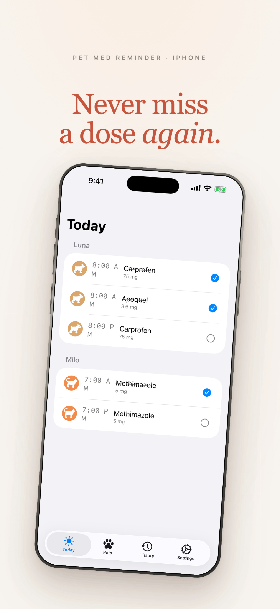

# Pet Med Reminder

A simple iOS app for tracking your pet's medications, supplements, treats, and scheduled care items. Designed for the human caregiver, not the pet.

  

[**Download on the App Store →**](https://apps.apple.com/us/app/pet-med-reminder-tracker/id6772127484)

---

## What it does

- Schedule any care item (medication, supplement, chew, drop, treat) for one or more pets.
- Get a notification when a dose is due. Tap **Mark Given** from the lock screen — no app launch required.
- See a history of every dose, every pet, every caregiver.
- Export a vet-ready PDF report any time.

Built for dogs and cats. Multi-pet from day one. No account required.

---

## Privacy Policy

**Last updated:** 2026-08-19

Pet Med Reminder is built for people who don't want to think about whether their pet app is harvesting their data. Here is exactly what happens.

### Data we collect about you

**None.** Pet Med Reminder does not require an account, does not ask for your email, does not ask for your name, does not access your contacts, does not use your camera (except when *you* attach a pet photo, which never leaves your device + your iCloud), does not request your location, and does not link any identifier to you.

### Data the app stores

The app stores the data *you* create: your pet names, the items you schedule, the doses you log, and any photos you attach. This data is stored:

1. **Locally on your iPhone**, in the app's private storage.
2. **In your personal iCloud account**, via Apple's CloudKit framework, if you have iCloud Drive enabled. This is the same mechanism that backs up Apple's own Notes, Reminders, and Health apps. Your data is stored in *your* iCloud — we have no access to it.

We do not have a server. We do not run a backend. We cannot see your pet's name, your dose history, your photos, or anything else you enter into the app.

### Anonymous usage analytics

The app records a small number of anonymous events through [PostHog](https://posthog.com) to help us understand whether features are working. Each event includes:

- A timestamp
- How many pets you have (1, 2, 3, etc. — never their names)
- How many caregivers have logged doses on this household (1 or more — never who)
- The frequency mode of the care item being logged (daily / every-N-days / specific days of week)

**These events do not contain your name, your pet's name, your email, your IP address, your device ID, or any identifier that could be linked back to you.** PostHog is configured to not collect IP addresses or device identifiers.

### This website

Most of this website is static and records nothing at all. One page, `/vet`, is the link printed on cards handed out by veterinary clinics, and it records a single anonymous event so we can tell how many people that channel actually reaches. That event contains a timestamp, whether the visitor is on an iPhone, and the referring page if there is one.

It does not create a profile for you, does not set an advertising identifier, and does not record your session. As with any web request, our analytics provider receives the IP address your request came from. No other page on this site records anything.

### Crash reports

If the app crashes, Apple's TestFlight or App Store Connect may automatically send us a crash report. These reports are anonymous and contain only information about *what* went wrong (stack trace, device model, iOS version) — not who you are or what was in your data.

### Children

Pet Med Reminder is rated 4+ in the App Store and is not directed at children under 13. We do not knowingly collect any data from children.

### Changes to this policy

If we change this policy, we will update the date above and post the new version at this URL. Material changes will also be noted in the App Store release notes for the next version.

### Contact

For questions about this policy or how the app handles your data: **dpaola2@gmail.com**.

---

© 2026 Dave Paola. Made in Boston.
